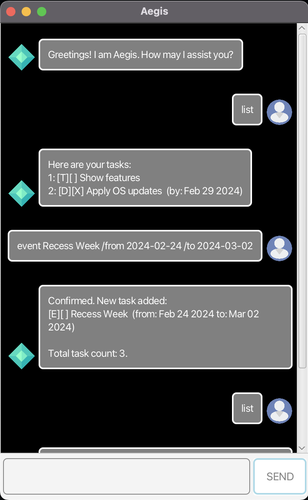

# Aegis Assistant User Guide



Aegis Assistant is a chatbot program designed to help you keep track of
your tasks. No more having to remember what tasks you have to complete and when, simply enter them into Aegis and it'll remember them all for you.

Aegis Assistant comes with the following functions:
1. Adding tasks
2. Listing your tasks
3. Setting a task as completed/uncompleted
4. Deleting tasks
5. Finding tasks
6. Tagging tasks

---
## 1. Adding tasks

Aegis can handle 3 different types of tasks, each with their own specific details. 

1. ToDo - A simple todo task
2. Deadline - A task with a deadline to complete by
3. Event - A task that occurs within a period of time

Creating each type of task uses a different command.

### ToDo Task

Command: `todo <Task Description>`

Example: `todo Charge my laptop`

This creates a ToDo task with the description 'Charge my laptop':

```
[T][] Charge my laptop
```

### Deadline Task

Command: `deadline <Task Description> /by <Date in YYYY-MM-DD>`

Example: `deadline Submit assignment /by 2024-02-25`

This creates a Deadline task with the description 'Submit assignment' and a deadline that displays as 'Feb 25 2024':

```
[D][] Submit assignment (by:Feb 25 2024)
```

### Event Task

Command: `event <Task Description> /from <Date in YYYY-MM-DD> /to <Date in YYYY-MM-DD>`

Example: `event Recess Week /from 2024-02-24 /to 2024-03-02`

This creates an Event task with the description 'Recess Week' and a from date of 'Feb 24 2024' to an end date of 'Mar 02 2024':

```
[E][] Recess Week (from:Feb 24 2024 to:Mar 02 2024)
```
---
## 2. Listing your tasks

Aegis Assistant can list out all your tasks with their completion status.

Command: `list`

This displays an indexed list of your tasks:

```
Here are your tasks:
1. [T][] Charge my laptop
2. [D][] Submit assignment 1 (by:Feb 25 2024)
3. [E][] Recess Week (from:Feb 24 2024 to:Mar 02 2024)
```
---
## 3. Setting a task a completed/uncompleted

Aegis Assistant can mark a task as completed or uncompleted for you. Simply use the `mark`/`unmark` command and provide the task index shown when using the `list` command.

### Mark task as completed

Command: `mark <Task Index>`

Example: `mark 1`

Aegis Assistant will confirm that the task has been marked completed:

```
Well done, task marked as completed.
[T][X] Charge my laptop
```

### Mark task as uncompleted

Command: `unmark <Task Index>`

Example: `unmark 1`

Aegis Assistant will confirm that the task has been marked uncompleted:

```
Understood, task marked as uncompleted.
[T][] Charge my laptop
```
---
## 4. Deleting tasks

Aegis Assistant can delete tasks from the task list if you do not wish to keep track of the task anymore. Provide the task index of the task you want to delete as shown when using the `list` command.

Command: `delete <Task Index>`

Example: `delete 1`

Aegis Assistant will confirm that the task has been deleted:

```
Acknowledged. The following task has been removed:
[T][] Charge my laptop
```
---
## 5. Finding Tasks

Aegis Assistant can help you find tasks with descriptions containing a specified keyword.

Command: `find <Keyword>`

Example `find assignment`

Aegis Assistant will return a list of tasks with descriptions that contain the keyword:

```
These tasks match the keyword you provided:
[T][] Check due date of assignments
[D][] Submit assignment 1 (by:Feb 25 2024) 
```
---
## 6. Tagging Tasks

Aegis Assistant can tag a task for you. Provide the task index of the task you want to tag as shown when using the `list` command.

Command `tag <Task Index> #<Tag>`

Example `tag 2 #urgent`

Aegis Assistant will confirm that the task has been tagged:
```
Confirmed. The following task has been tagged with #urgent:
[D][] Submit assignment 1 #urgent (by: Feb 25 2024)
```
---
